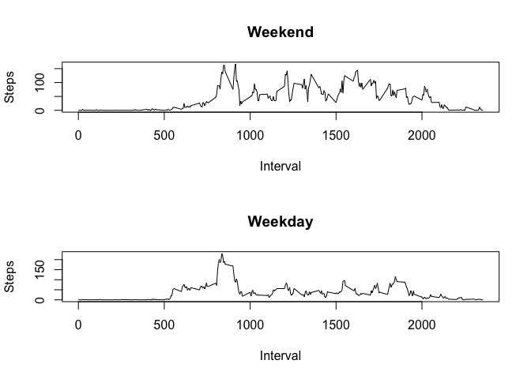

# Reproducible Research: Peer Assessment 1


## Loading and preprocessing the data

```r
act<-read.csv("activity.csv")
```


## What is mean total number of steps taken per day?
The total number of steps per day is

```r
stepsDay<-aggregate(act[,1],list(act$date),sum,na.rm=TRUE)
stepsDay
```

```
##       Group.1     x
## 1  2012-10-01     0
## 2  2012-10-02   126
## 3  2012-10-03 11352
## 4  2012-10-04 12116
## 5  2012-10-05 13294
## 6  2012-10-06 15420
## 7  2012-10-07 11015
## 8  2012-10-08     0
## 9  2012-10-09 12811
## 10 2012-10-10  9900
## 11 2012-10-11 10304
## 12 2012-10-12 17382
## 13 2012-10-13 12426
## 14 2012-10-14 15098
## 15 2012-10-15 10139
## 16 2012-10-16 15084
## 17 2012-10-17 13452
## 18 2012-10-18 10056
## 19 2012-10-19 11829
## 20 2012-10-20 10395
## 21 2012-10-21  8821
## 22 2012-10-22 13460
## 23 2012-10-23  8918
## 24 2012-10-24  8355
## 25 2012-10-25  2492
## 26 2012-10-26  6778
## 27 2012-10-27 10119
## 28 2012-10-28 11458
## 29 2012-10-29  5018
## 30 2012-10-30  9819
## 31 2012-10-31 15414
## 32 2012-11-01     0
## 33 2012-11-02 10600
## 34 2012-11-03 10571
## 35 2012-11-04     0
## 36 2012-11-05 10439
## 37 2012-11-06  8334
## 38 2012-11-07 12883
## 39 2012-11-08  3219
## 40 2012-11-09     0
## 41 2012-11-10     0
## 42 2012-11-11 12608
## 43 2012-11-12 10765
## 44 2012-11-13  7336
## 45 2012-11-14     0
## 46 2012-11-15    41
## 47 2012-11-16  5441
## 48 2012-11-17 14339
## 49 2012-11-18 15110
## 50 2012-11-19  8841
## 51 2012-11-20  4472
## 52 2012-11-21 12787
## 53 2012-11-22 20427
## 54 2012-11-23 21194
## 55 2012-11-24 14478
## 56 2012-11-25 11834
## 57 2012-11-26 11162
## 58 2012-11-27 13646
## 59 2012-11-28 10183
## 60 2012-11-29  7047
## 61 2012-11-30     0
```
Histogram

```r
hist(stepsDay$x)
```

<!-- -->

The mean and median per day

```r
library(plyr)
stats<-ddply(act,~date,summarise,mean=mean(steps,na.rm=TRUE),median=median(steps,na.rm=TRUE))
stats
```

```
##          date       mean median
## 1  2012-10-01        NaN     NA
## 2  2012-10-02  0.4375000      0
## 3  2012-10-03 39.4166667      0
## 4  2012-10-04 42.0694444      0
## 5  2012-10-05 46.1597222      0
## 6  2012-10-06 53.5416667      0
## 7  2012-10-07 38.2465278      0
## 8  2012-10-08        NaN     NA
## 9  2012-10-09 44.4826389      0
## 10 2012-10-10 34.3750000      0
## 11 2012-10-11 35.7777778      0
## 12 2012-10-12 60.3541667      0
## 13 2012-10-13 43.1458333      0
## 14 2012-10-14 52.4236111      0
## 15 2012-10-15 35.2048611      0
## 16 2012-10-16 52.3750000      0
## 17 2012-10-17 46.7083333      0
## 18 2012-10-18 34.9166667      0
## 19 2012-10-19 41.0729167      0
## 20 2012-10-20 36.0937500      0
## 21 2012-10-21 30.6284722      0
## 22 2012-10-22 46.7361111      0
## 23 2012-10-23 30.9652778      0
## 24 2012-10-24 29.0104167      0
## 25 2012-10-25  8.6527778      0
## 26 2012-10-26 23.5347222      0
## 27 2012-10-27 35.1354167      0
## 28 2012-10-28 39.7847222      0
## 29 2012-10-29 17.4236111      0
## 30 2012-10-30 34.0937500      0
## 31 2012-10-31 53.5208333      0
## 32 2012-11-01        NaN     NA
## 33 2012-11-02 36.8055556      0
## 34 2012-11-03 36.7048611      0
## 35 2012-11-04        NaN     NA
## 36 2012-11-05 36.2465278      0
## 37 2012-11-06 28.9375000      0
## 38 2012-11-07 44.7326389      0
## 39 2012-11-08 11.1770833      0
## 40 2012-11-09        NaN     NA
## 41 2012-11-10        NaN     NA
## 42 2012-11-11 43.7777778      0
## 43 2012-11-12 37.3784722      0
## 44 2012-11-13 25.4722222      0
## 45 2012-11-14        NaN     NA
## 46 2012-11-15  0.1423611      0
## 47 2012-11-16 18.8923611      0
## 48 2012-11-17 49.7881944      0
## 49 2012-11-18 52.4652778      0
## 50 2012-11-19 30.6979167      0
## 51 2012-11-20 15.5277778      0
## 52 2012-11-21 44.3993056      0
## 53 2012-11-22 70.9270833      0
## 54 2012-11-23 73.5902778      0
## 55 2012-11-24 50.2708333      0
## 56 2012-11-25 41.0902778      0
## 57 2012-11-26 38.7569444      0
## 58 2012-11-27 47.3819444      0
## 59 2012-11-28 35.3576389      0
## 60 2012-11-29 24.4687500      0
## 61 2012-11-30        NaN     NA
```


## What is the average daily activity pattern?

```r
stepsInt<-aggregate(act[,1],list(act$interval),sum,na.rm=TRUE)
plot(stepsInt$Group.1,stepsInt$x,type="l",xlab="Interval",ylab="Total Steps")
```

<!-- -->

```r
maxStInt<-stepsInt[stepsInt$x==max(stepsInt$x),1]
```
The  5-minute interval that contains the maximum number of steps is 835


## Imputing missing values


```r
missVal<-sum(is.na(act$steps))
```
The total number of missing values is 2304.

A new data set will contain the same data with NAs values changed by the media in the interval 


```r
stepsIntMean<-aggregate(act[,1],list(act$interval),mean,na.rm=TRUE)
act2<-act
for (i in 1:length(act$steps)){
        if (is.na(act2[i,1])==TRUE){
                act2[i,1]<-stepsIntMean[stepsIntMean$Group.1==act2[i,3],2]
        }
}
```

Histogram of the new data set

```r
stepsDay2<-aggregate(act2[,1],list(act2$date),sum,na.rm=TRUE)
hist(stepsDay2$x)
```

<!-- -->

The mean and median per day

```r
stats2<-ddply(act2,~date,summarise,mean=mean(steps,na.rm=TRUE),median=median(steps,na.rm=TRUE))
stats2
```

```
##          date       mean   median
## 1  2012-10-01 37.3825996 34.11321
## 2  2012-10-02  0.4375000  0.00000
## 3  2012-10-03 39.4166667  0.00000
## 4  2012-10-04 42.0694444  0.00000
## 5  2012-10-05 46.1597222  0.00000
## 6  2012-10-06 53.5416667  0.00000
## 7  2012-10-07 38.2465278  0.00000
## 8  2012-10-08 37.3825996 34.11321
## 9  2012-10-09 44.4826389  0.00000
## 10 2012-10-10 34.3750000  0.00000
## 11 2012-10-11 35.7777778  0.00000
## 12 2012-10-12 60.3541667  0.00000
## 13 2012-10-13 43.1458333  0.00000
## 14 2012-10-14 52.4236111  0.00000
## 15 2012-10-15 35.2048611  0.00000
## 16 2012-10-16 52.3750000  0.00000
## 17 2012-10-17 46.7083333  0.00000
## 18 2012-10-18 34.9166667  0.00000
## 19 2012-10-19 41.0729167  0.00000
## 20 2012-10-20 36.0937500  0.00000
## 21 2012-10-21 30.6284722  0.00000
## 22 2012-10-22 46.7361111  0.00000
## 23 2012-10-23 30.9652778  0.00000
## 24 2012-10-24 29.0104167  0.00000
## 25 2012-10-25  8.6527778  0.00000
## 26 2012-10-26 23.5347222  0.00000
## 27 2012-10-27 35.1354167  0.00000
## 28 2012-10-28 39.7847222  0.00000
## 29 2012-10-29 17.4236111  0.00000
## 30 2012-10-30 34.0937500  0.00000
## 31 2012-10-31 53.5208333  0.00000
## 32 2012-11-01 37.3825996 34.11321
## 33 2012-11-02 36.8055556  0.00000
## 34 2012-11-03 36.7048611  0.00000
## 35 2012-11-04 37.3825996 34.11321
## 36 2012-11-05 36.2465278  0.00000
## 37 2012-11-06 28.9375000  0.00000
## 38 2012-11-07 44.7326389  0.00000
## 39 2012-11-08 11.1770833  0.00000
## 40 2012-11-09 37.3825996 34.11321
## 41 2012-11-10 37.3825996 34.11321
## 42 2012-11-11 43.7777778  0.00000
## 43 2012-11-12 37.3784722  0.00000
## 44 2012-11-13 25.4722222  0.00000
## 45 2012-11-14 37.3825996 34.11321
## 46 2012-11-15  0.1423611  0.00000
## 47 2012-11-16 18.8923611  0.00000
## 48 2012-11-17 49.7881944  0.00000
## 49 2012-11-18 52.4652778  0.00000
## 50 2012-11-19 30.6979167  0.00000
## 51 2012-11-20 15.5277778  0.00000
## 52 2012-11-21 44.3993056  0.00000
## 53 2012-11-22 70.9270833  0.00000
## 54 2012-11-23 73.5902778  0.00000
## 55 2012-11-24 50.2708333  0.00000
## 56 2012-11-25 41.0902778  0.00000
## 57 2012-11-26 38.7569444  0.00000
## 58 2012-11-27 47.3819444  0.00000
## 59 2012-11-28 35.3576389  0.00000
## 60 2012-11-29 24.4687500  0.00000
## 61 2012-11-30 37.3825996 34.11321
```

The correlation plot between the mean of the two data sets (with and without NAs) shows that the results are similar

```r
plot(stats$mean,stats2$mean)
```

<!-- -->

The values for the median are similar for the days in which there are not NAs (median=0) and differs in the days in which all steps were NA (median=34.11321)


## Are there differences in activity patterns between weekdays and weekends?

 First create the data set with a new column
 

```r
act3<-act2
act3$Day<-weekdays(as.Date(act2$date))
act3[act3$Day=="domingo"|act3$Day=="sábado",]$Day<-"weekend"
act3[act3$Day=="lunes"|act3$Day=="martes"|act3$Day=="miércoles"|act3$Day=="jueves"|act3$Day=="viernes",]$Day<-"weekday"
act3$Day<-as.factor(act3$Day)
```

Create data sets for weekdays and weekends an plot the average of steps by interval


```r
Weekend<-act3[act3$Day=="weekend",]
Weekday<-act3[act3$Day=="weekday",]
stepsIntWD<-aggregate(Weekday[,1],list(Weekday$interval),mean)
stepsIntW<-aggregate(Weekend[,1],list(Weekend$interval),mean)
par(mfrow=(c(2,1)))
plot(stepsIntW$Group.1,stepsIntW$x,type="l",main="Weekend",ylab="Steps",xlab="Interval")
plot(stepsIntWD$Group.1,stepsIntWD$x,type="l",main="Weekday",ylab="Steps",xlab="Interval")
```

<!-- -->

There are significant differences in the activity depending on wether the day is weekday or weekend. 

